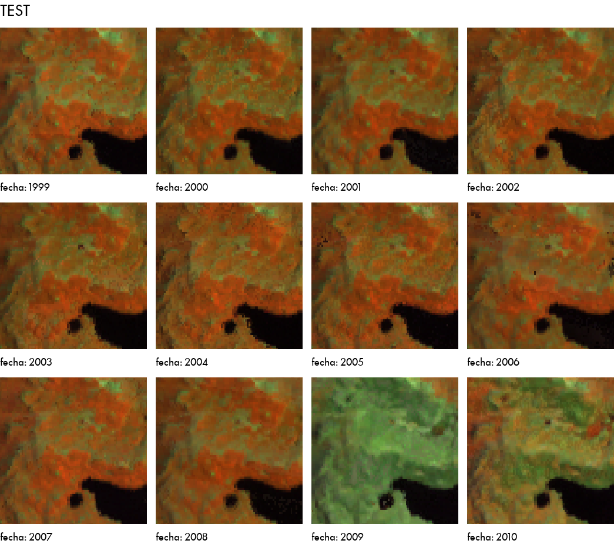

# Google Earth Engine images using the Pillow (PIL) package (python)

The main goal of this package is to create image strips from Google Earth 
Engine imagery.

There are some abstractions that could be used for other purposes eventually.

## Install

> pip install geepillow

The result will look something like this

